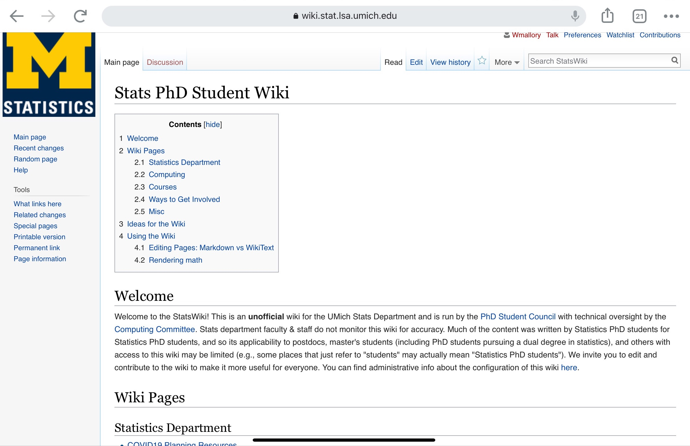
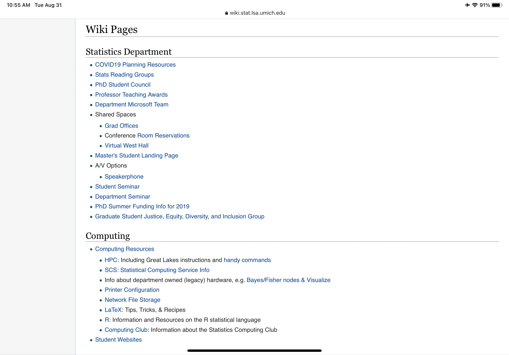
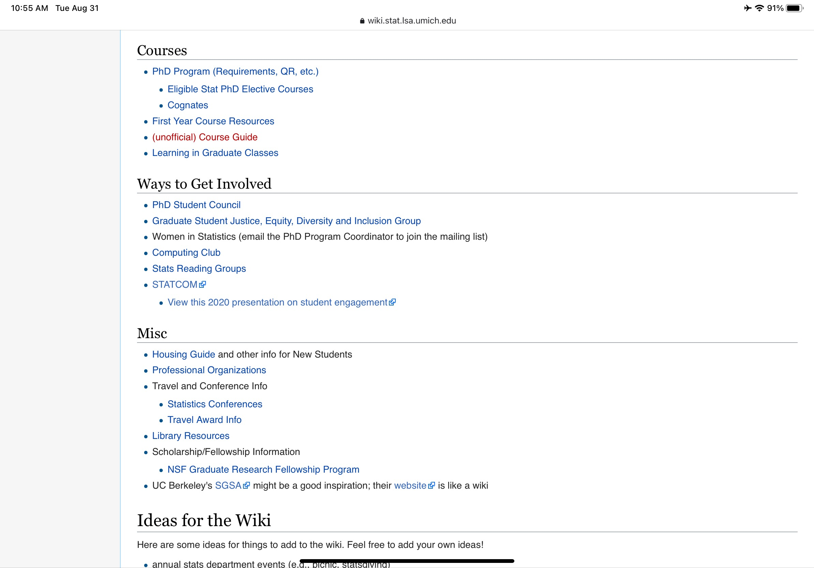
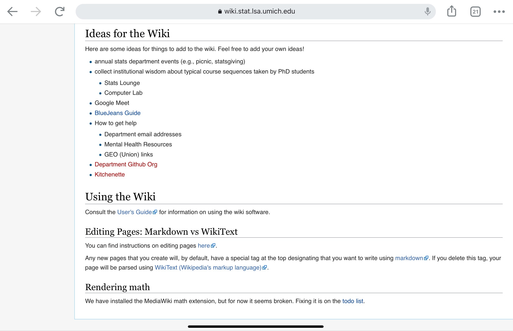

# The future of the wiki

I wanted to lay-out some potential avenues of growth for the department wiki beyond a computing wiki. I think it's worth while to understand the potential avenues the wiki can grow in order to

1. understand if future requests to the computing TA about pages really make sense in the "computer wiki" part of the wiki
2. to understand what parts of the future department website can potentially be delegated to a wiki page
3. to a clear understanding of the audience and privacy settings of a global wiki might be

That being said, I think slowly growing the wiki with pages (like we are doing now) makes more sense than setting up too much structure (especially since this wiki will mostly be grown with volunteers).

# What are other people doing?

I've come across two good examples of other department at other universities that have department wikis (beyond just a computing wiki).

1. University of Wisconsin, Math Department: public (https://hilbert.math.wisc.edu/wiki/index.php/Main_Page)
2. University of Michigan, Statistics Department: private-- see below (https://lsa.umich.edu/stats/phd-students/statistics-ph-d--student-council.html)

Other examples (with varying goals and information)

3. Earlham College, Computer Science Department: public (https://wiki.cs.earlham.edu/index.php/Main_Page)
4. James Madison University, Computer Science Department: public student wiki (computing + student information) (https://wiki.cs.jmu.edu/student/start)
5. UC Berkeley, Math Department: public "computing" wiki (https://math.berkeley.edu/computing/wiki/index.php/Main_Page)
6. UC Berkeley, Statistics Department: public wiki (http://sgsa.berkeley.edu/)

\* The UCB Stat one might be decent to look at and the JMU one has some computing resources that we are trying to create versions of as well...

## Thoughts on University of Wisconsin, Math department's wiki.

I encourage you to explore the this public wiki. There are some phone-number and individual information that might be best not posted on a public wiki (similar probably to the fact that we post printer information on a public page of our website...), but I think this wiki shows that you really can provide a lot of information in a public way. I think the use of a wiki for their "[Graduate Student Guide](https://hilbert.math.wisc.edu/wiki/index.php/Graduate_Student_Guide)"
is probably more manageable than our current use of a google drive version.

Although the organization might not exactly be the easiest to use, they have pages relative to:

1. computing resources
2. student life
3. seminars and research groups
4. past qualifiying exams
5. some documents on computing and special lectures

Naturally some of this would be hosted on our department website and the accessiblity to edit pages of department website probably means we don't really need research groups on the wiki, but the versiatility of a more global wiki might reduce the need to find student google documents that list all the current running research groups / seminars.

## Thoughts on University of Michigan, Statistics department's wiki

I have a friend at UMichigan so I asked here to take a few screen shots of the private wiki, and they are presented below.

In general I think the structure of this private student wiki is great. I'm not 100% sure why these pages needed to be private, but the structure of

1. general department
2. computing
3. courses
4. getting involved

seems like a lot of good resources for PhD students.

# Thoughts on information sharing and privacy

I think this committee has been very eager to make sure space exists for private internal documents, and I think from a faculty point of few the question is always "do I really want the PhD students to read this?" This is a fair point for faculty level documents but I personally believe that hiding our wiki, specifically our computing wiki, behind a privacy wall seems like wasted potential - especially since (at least) other statistics department might benefit these communally developed resources.

